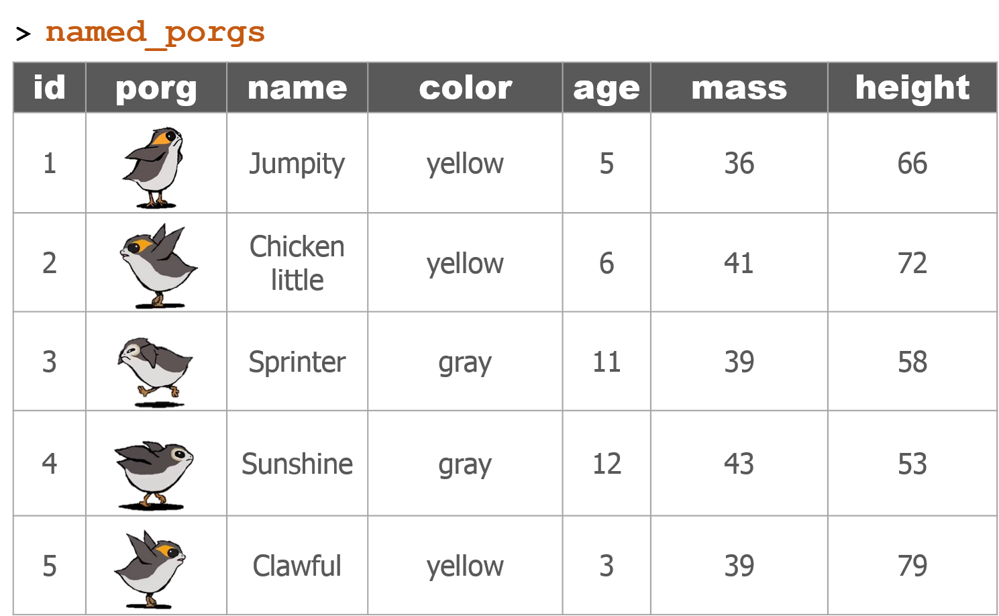
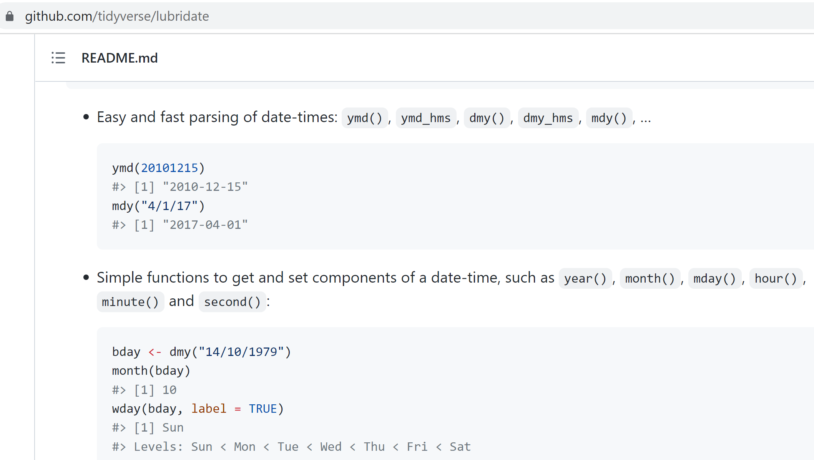

<style>
h1 .header-section-number {background: #c75a16;}
hr {background: #c75a16;}
</style>


```{r setup, include=FALSE}
knitr::opts_chunk$set(echo = TRUE, warning = F, message = F)
knitr::opts_chunk$set(fig.width = 10, fig.height = 5.2) 
htmltools::tagList(rmarkdown::html_dependency_font_awesome())
xaringanExtra::use_clipboard()
```


# Day 1 review
<hr>


## Get to know your __DATA__ {-}

<div class="tip">

| Function | Information             |  
|:------|:---------------------------|  
| `names(scrap)`  | column names            |  
| `nrow(...)`     | number of rows          |  
| `ncol(...)`     | number of columns       | 
| `summary(...)`  | summary of all column values (ex. _max_, _mean_, _median_)  | 
| `glimpse(...)`  | column names + a glimpse of first values (requires _dplyr_ package)   |  


</div>

## Filtering {-}

<div class="pinkcode">

> <h3 style="margin-top: 8px; margin-bottom: -4px;"> Menu of comparisons </h3>
>
> | Symbol | Comparison               |
> |:-------|:-------------------------|
> | `>`    | greater than             |
> | `>=`   | greater than or equal to |
> | `<`    | less than                |
> | `<=`   | less than or equal to    |
> | `==`   | equal to                 |
> | `!=`   | NOT equal to             |
> | `%in%` | value is in list: `X %in% c(1,3,7)` |
> | `is.na(...)`  | is the value missing? |
> | `str_detect(col_name, "word")`  | "word" appears in text? |
>

</div>

```{r tools, child='../../static/modules/dplyr/dplyr_toolbox/general.Rmd'}
```


## `dplyr` with Porgs {-}

The _poggle_ of porgs are back to help us review `dplyr` functions. 

```{r, eval = F}
library(tidyverse)

porgs <- read_csv("https://mn-r.netlify.com/data/porg_data.csv")
```

<br>

```{r porg-tabs, results='asis', echo=F}
cat(readLines("porg_tabs.txt"))
```


# Day 2 review
<hr>

- Join tables with `left_join()`
- `summarize()` functions
- Group by category with `group_by()`
- `ifelse()`: if THIS IS TRUE do a thing, otherwise do a different thing
- Plots and charts with `ggplot`


```{r, eval = F}
library(tidyverse)

porgs <- read_csv("https://mn-r.netlify.com/data/porg_data.csv")

porg_names <- read_csv("https://mn-r.netlify.com/data/porg_names.csv")
```


{style="width: 98%; margin-top: 12px;"}

<br>

### __The joined table__ {-}

```{r, eval = F}
named_porgs <- left_join(porgs, porg_names, by = "id")
```

<div class="well">
{style="width: 92%;"}
</div>

<br>


## Welcome to Endor! {-}
<hr class="hrlvl2">

{style="width: 75%; margin-top: -4px; margin-left: 11%;"}


```{r sf, child='../../static/modules/maps/leaflet.Rmd'}
```


# Invasive Porg Survey - 2023 
<hr>
```{r porg-survey, child='../../static/modules/dates/porg_survey.Rmd'}
```


<br>


# <i class="fa fa-group" style="color: steelblue;"></i> Share with friends
<hr>


## Create a GitHub account {-}
<hr class="hrlvl2">

It's time to share with your R friends. [Join GitHub](https://github.com/)

[](https://github.com/)


## Add a new repository {-}

Now we can create a new `repository` to store some of our new R plots and scripts. Click the bright green `New` button to get started.


- Give it a short name like `Rplots`
- Keep it public
- [x] Check the box to initialize with a README 
- Click `[ Create repository ]`

## Add an R script or plot {-}

Click `Upload files` to add an image of an R plot or one of your `.R` scripts.


## Package questions {-}

Google: `"package name" + github`

For example, here's the top page for `lubridate + github`



## Secret work projects {-}

- `MDH`: Internal secret Gitlab
- `MPCA`: Coming soon...

<br>

### <i class="fa fa-rocket" aria-hidden="true"></i> Return to [Homebase](../post/day-3.html) {-}

<br>
