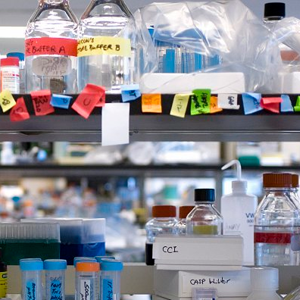

```{r setup, include=FALSE}
knitr::opts_chunk$set(warning = F, message = F)
knitr::opts_chunk$set(fig.width = 10, fig.height = 5.2) 
htmltools::tagList(rmarkdown::html_dependency_font_awesome())
xaringanExtra::use_clipboard()
```


# Psst...we really need to talk
<hr>

```{r bert-ernie, child='../../static/modules/games/lets_talk.Rmd'}
```

<br>

# R Markdown reports
<hr>

```{r mark-demo, child='../../static/modules/markdown/demo.Rmd'}
```

<br>


# Connect to databases <i class="fa-solid fa-database"></i>
<hr>

> Top-secret demo....

<br>


# Your turn
<hr>

Time to start putting what we've learned to use. Choose one of the paths below and use your new hard-earned R skills to explore data. When you feel ready, jump to the <i class="fa fa-star fa-xs" aria-hidden="true" style="color: #fa970c;"></i><i class="fa fa-star fa-xs" aria-hidden="true" style="color: #fa970c;"></i><i class="fa fa-star fa-xs" aria-hidden="true" style="color: #fa970c;"></i> Grand Moff path and begin exploring and making a report for your __own__ data. 


<div class="row3" style = "margin-top: 20px;">

<div class="column3"><span style="margin-left: 2px;">
<a href="level1_jakku_explore.html"><i class="fa fa-star" aria-hidden="true" style="color: #fa970c;"></i> __ENSIGN__ </a>
</span></div> 

<div class="column3"> <span style="margin-left: 2px; display: inline;">
<a href="level2_porg_exposure.html"> <i class="fa fa-star" aria-hidden="true" style="color: #fa970c;"></i><i class="fa fa-star" aria-hidden="true" style="color: #fa970c;"></i> __COMMODORE__ </a> 
</span></div> 

<div class="column3"> <span style="margin-left: 2px;">
<a href="level3_example_outline.html"><i class="fa fa-star" aria-hidden="true" style="color: #fa970c;"></i><i class="fa fa-star" aria-hidden="true" style="color: #fa970c;"></i><i class="fa fa-star" aria-hidden="true" style="color: #fa970c;"></i> __GRAND MOFF__ </a>
</span></div>
</div>


<div class="row3">

<div class="column3" style="height: 232px; max-height: 232px;">
<div class="" style="border: 1px solid grey;">
<a href="level1_jakku_explore.html"></a>
</div></div>

<div class="column3" style="height: 232px; max-height: 232px;">
<div class="" style="border: 1px solid grey;">
<a href="level2_porg_exposure.html"></a>
</div></div>

<div class="column3" style="height: 232px; max-height: 232px;">
<div class="" style="border: 1px solid grey;">
<a href="level3_example_outline.html"></a>
</div></div>

</div>


<div class="row3" style = "margin-top: 22px;">
<div class="column3">

Explore the scrap and salvage economy on Jakku.

Media: `solid waste`  
Planet: `Jakku`
</div>

<div class="column3">
Study the effects of jet-fuel on Porg reflexes.

Media: `biological`  
Planet: `Ahch-To`
</div> 

<div class="column3">
Travel back to Earth and explore your own data set.

Media: `all`  
Planet: `Earth`
</div>

</div>
 
<br>

## 🐱 Concatulations! {-}
<hr class="hrlvl2">

#### You make an excellent Data Droid! Rey and BB8 couldn't have done it without you.  {-}

> You deserve an award.

```
    Meowwwwww R Users! 
      \
       \
        \
            |\___/|
          ==) ^Y^ (==
            \  ^  /
             )=*=(
            /     \
            |     |
           /| | | |\
           \| | |_|/\
      jgs  //_// ___/
               \_)
```

<br>


<br>

# <i class="fas fa-globe-americas"></i> Back to Earth {-}
<hr>

You're free! You can return to Earth now. Go ahead and robot frolic in the grass, enjoy the solar power, and jump in a lake. To help you fully acclimate, let's look at some Earth data. 
 
<br>

Choose one of the data exercises below to begin.

<div class="row3" style="margin-top: 20px;">

<div class="column3"><div align="center" style="margin-left: -18px;">
<a href="explore_wind_rose.html"> __Air and Wind__ </a>
</div></div> 

<div class="column3"> <div align="center">
<a href="explore_GIS_maps.html" style="margin-left: auto;"> __Maps for humans__ </a>
</div></div> 

<div class="column3"> <div align="center">
<a href="explore_messy_emissions.html" style="margin-left: auto;"> __Tidy emissions__ </a>
</div></div> 


</div>


<div class="row3">

<div class="column3" style="height: 160px; max-height: 160px;">
<div class="" style="border: 0px solid grey;">
<a href="explore_wind_rose.html">
{style="width: 290px; margin-top: 14px;"}
</a>
</div></div>

<div class="column3" style="height: 160px; max-height: 160px;">
<div class="" style="border: 1px solid grey; max-height: 160px; overflow: hidden;">
<a href="explore_GIS_maps.html"></a>
</div></div>

<div class="column3" style="height: 160px; max-height: 160px;">
<div class="" style="border: 1px solid grey; max-height: 160px; overflow: hidden;">
<a href="explore_messy_emissions.html"></a>
</div></div>

</div>


<div class="row3">
<div class="column3">

Explore the connection between wind direction, wind speed, and pollution concentrations near Fond du Lac. Make a wind rose and then a `pollution rose`, two of my favorite flowers.  

</div>

<div class="column3">

Study the housing habits of Earthlings. Create interactive maps showing the spatial clustering of different social characteristics of the human species.  

</div> 

<div class="column3">

Start with messy wide data and transform into a tidy table ready for easy plotting, summarizing, and comparing. For the grand finale, read an entire folder of files into 1 table.

</div>

</div>

<div class="row3" style = "margin-top: 2px;">
<div class="column3">

Media: `air`   
Planet: `Earth`

</div>

<div class="column3">

Media: `social-human`   
Planet: `Earth`

</div>

<div class="column3">

Media: `air`   
Planet: `Earth`

</div>
</div>

<br>

### <i class="fa fa-rocket" aria-hidden="true"></i> Return to [Homebase](../post/day-3.html) {-}

<br>
