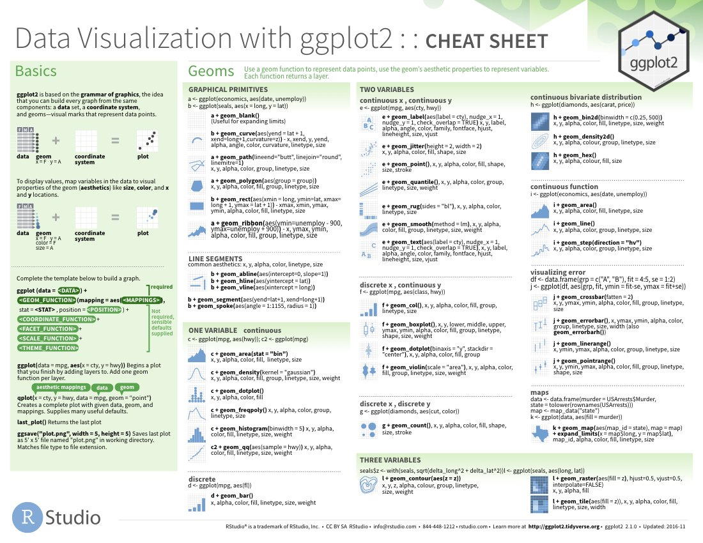

```{r setup, include=FALSE}
#knitr::opts_chunk$set()
#htmltools::tagList(rmarkdown::html_dependency_font_awesome())
#library(icon)
#<style> code {color: #535353 !important;} </style>
```


### Cheatsheets {-}

<a href="https://www.rstudio.com/wp-content/uploads/2018/08/data-visualization-2.1.png">
{style="width: 47%; float: right; margin-left: 20px; margin-top: -16px;"}
</a>

Use cheatsheets to refresh your memory and find new functions or plots. 

- In RStudio go to `Help > Cheatsheets`
    - __Data Transformation__ :: Helpful functions for cleaning and arranging your data.  
    - __Data Visualization__ :: Great reference for all your `ggplot`'ing options. 
   

### Find new packages and functions {-}

- Search packages in R with [CRANsearcher](https://github.com/RhoInc/CRANsearcher)
- [ROpenSci](https://ropensci.org/packages/) has packages and data for all types of environmental and "scientific" work.
- For water `r icons::fontawesome$solid$tint` the [USGS](https://github.com/USGS-R) shares water quality focused packages on GitHub.


    
__Searching online__

- Google: include `r` or `rstats` + `"the question"`
- Search or post on [stackoverflow.com](https://stackoverflow.com/questions/12675147/how-can-we-make-xkcd-style-graphs) + the `[r]` tag

__Inside R__

- Get function help and package info in R with `?arrange()` or `help(dplyr)`


__Teams__

- Post a question to the [Teams channel](https://teams.microsoft.com/l/channel/19%3ad589e61e13f245279211cce4e9a930e9%40thread.tacv2/Help%2520requests?groupId=6cd8293a-b134-455b-abce-b55adade3e64&tenantId=eb14b046-24c4-4519-8f26-b89c2159828c) 

<br>

## Troubleshooting

These are a few of the things we personally forget to do all the time and cause 90% of our errors. They're good first checks if R starts throwing errors or behaving strangely.
  
- Make sure all parentheses are balanced so that every opening `(` has a corresponding closing `)`.
- R doesn't love `\` backward slashes like _Windows_, check that they didn't sneak into your expression somewhere. When in doubt use the `/` forward slash.
- If you think you have completed typing your code, and instead of seeing the `>` command prompt at the console you see the `+` character instead. That's a good sign that either R is still thinking very-very hard, or it is still waiting for you to complete your expression. You can hit `Esc` or `Ctrl-C` to force your way back to the console and try typing your code again. 

- R is very picking about spelling. So are meteorologists when talking about _lighting storms_.


- In `ggplot` we build up plots one piece at a time by adding expressions to one another with the `+` character. When doing this, make sure the `+` goes at the end of each line, and not the beginning. 

Put the `+` sign here to make `ggplot` happy:

```{r trouble_gg1, echo=TRUE, eval=FALSE}
ggplot(data = mpg, aes(x = displ, y = hwy)) +
    geom_point()
```

Put it on the next line to make `ggplot` sad:

```{r trouble_gg2, echo=TRUE, eval=FALSE}
ggplot(data = mpg, aes(x = displ, y = hwy))
  + geom_point()
```

<br>

## Error messages

Not all error messages are helpful or easy to interpret, but they do seem to be getting better in many R packages. When googling an error message it can help to put the entire message in quotes. For the error below we would search for `"Error in fit[5, 100, ] : subscript out of bounds"`.

<div align="center" style="margin-top: 24px;">

{style="width: 50%;"}

</div>


<br>
